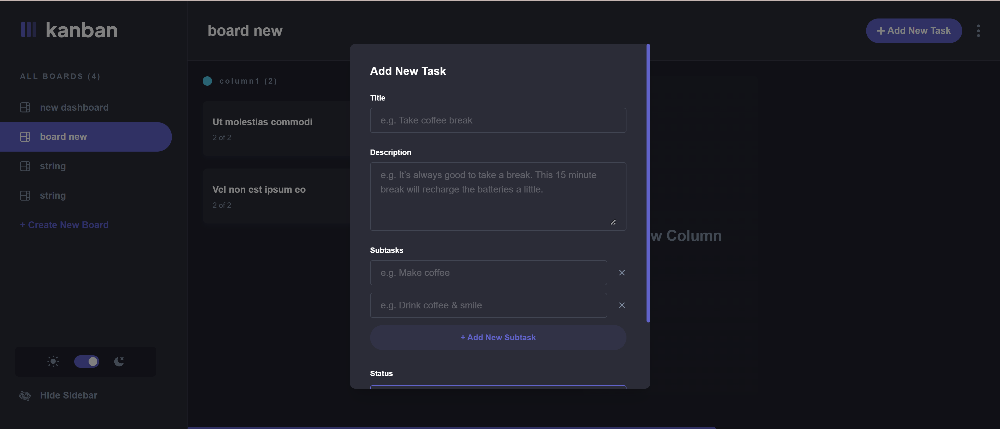
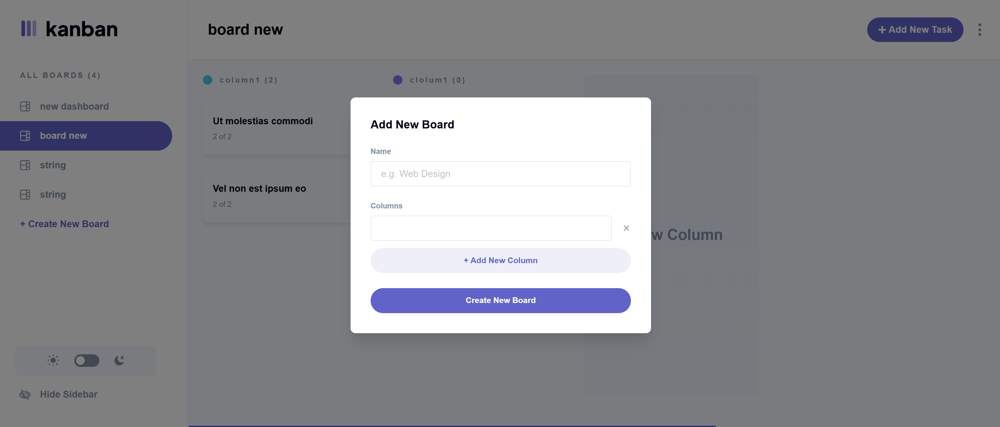
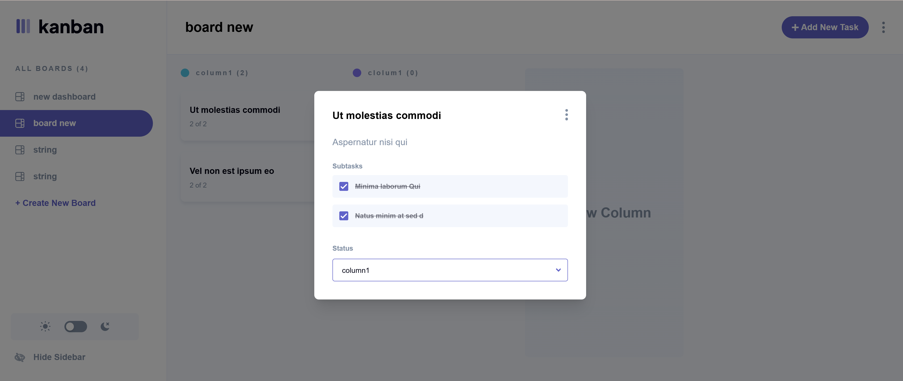
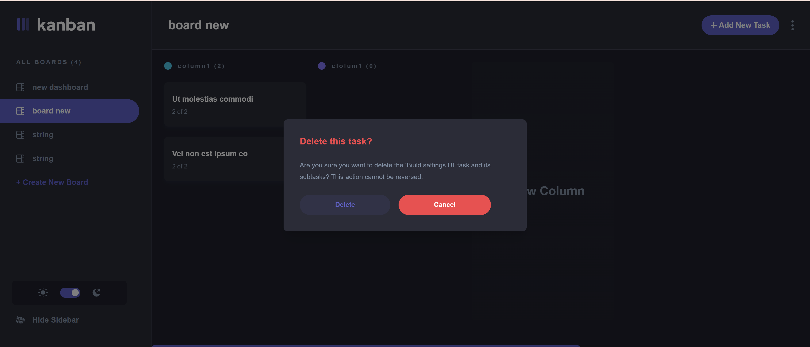
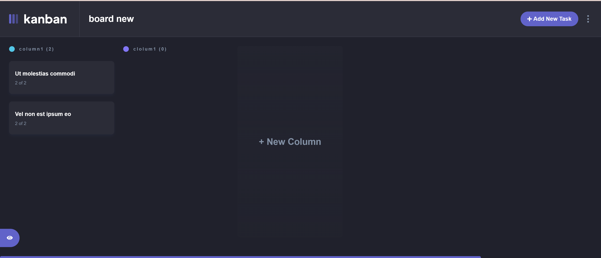
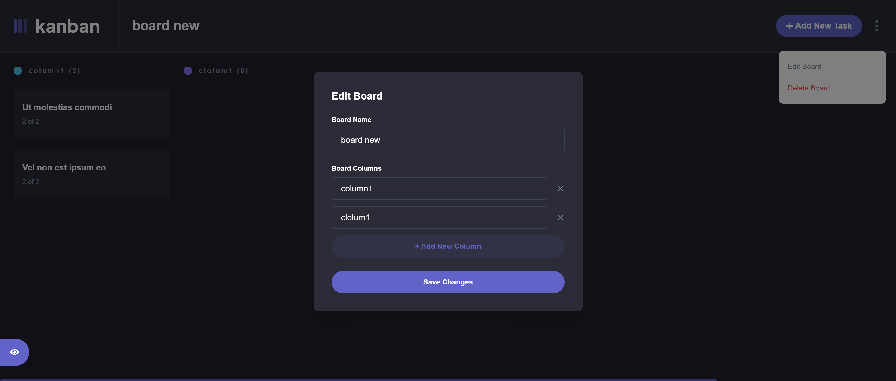
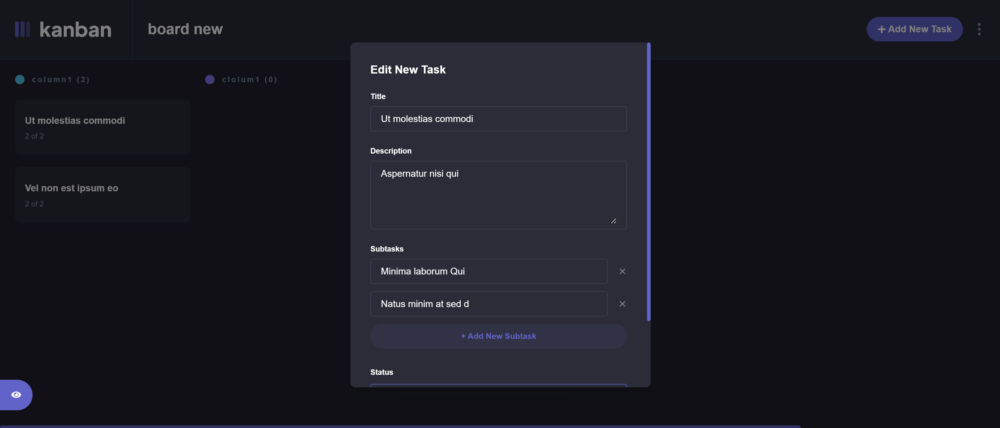

# Task Management Board 

A lightweight and responsive **Task Management Application** built with **Next15**, **Typescript** and **TailwindCSS**, featuring complete CRUD operations and state management via **React Query**. The backend is powered by **Express.js**, **Prisma**, **MySQL** with **Swagger** for API documentation.

## Features

- ✅ Create, edit and delete **boards**, **columns**, **subtasks** and **subtasks**
- ✅ Move task between columns via status updates
- ✅ Mark subtasks as done/undone
- ✅ Dark/Light mode support
- ✅ API requests managed via **React Query**
- ✅ Fully Responsive with horizontal scroll for columns
- ✅ Clean folder structure using featured-based structure
  
## Technologies

**Frontend:**
- Next.js 15 (App Router)
- React, Typescript
- Tailwind CSS
- React Hook Form + Zod
- React Query
- Zustand (for modal state and sidebar state)
- Framer Motion

**Backend:**
- Express.js
- Prisma ORM
- MySQL
- Swagger for API docs

## Getting Started

### 1. Start MySQL using XAMPP

Make sure **XAMPP is running** and the **MySQL service** is started before continuing.

### 2. Clone the project

```bash
mkdir novomed-project
cd novomed-project
git clone https://github.com/mhammadshami/novomed-fullstack-project.git .
```

### 3. Run the backend

```bash
cd backend
npm install
npx prisma generate
npx prisma migrate dev
npm run dev
```

Update `.env`:
```
DATABASE_URL="mysql://root:@localhost:3306/task_manager"
```

### 3. Run the front

```bash
cd frontend
npm install
npm run dev
```
OR

(Faster)
```bash
cd frontend
npm install
npm run build
npm start
```

## Swagger API

Once backend is running, visit:
```
http://localhost:5000/api-docs
```

## Folder Structure Highlights

```
/features:
  └── boards
  └── columns
  └── tasks
```

Each feature folder contains:
- `/api`: API logic
- `/components`: UI Components
- `/hooks`: Custom hooks
- `/types`: Typescript types
- `/validations`: Zod schemas

## Demo Video

[Click here to watch the demo video](./frontend/public/demo.mp4)

## Preview




















